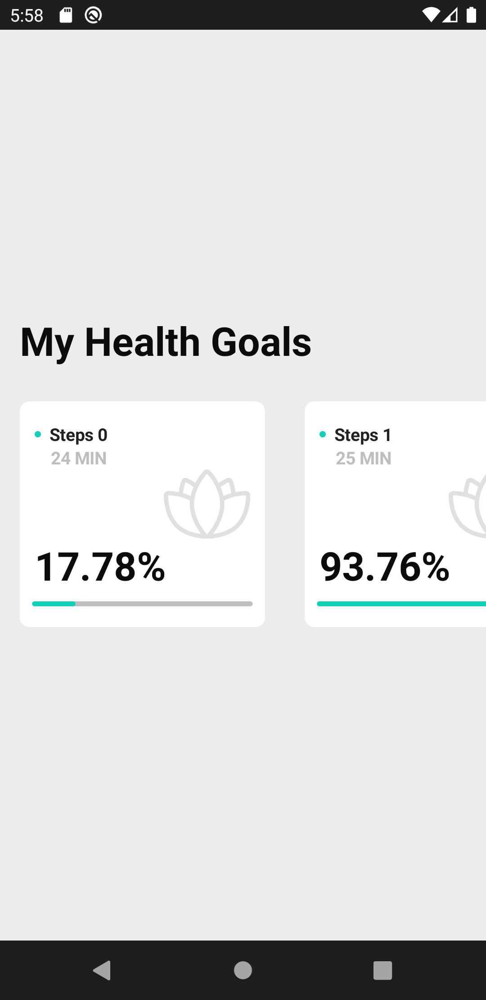

# Playground Jetpack Compose Samples

For more information, please [read the documentation](https://developer.android.com/jetpack/compose)

💻 Requirements
------------
To try out these sample apps, you need to use [Android Studio Arctic Fox](https://developer.android.com/studio).
You can clone this repository or import the
project from Android Studio following the steps
[here](https://developer.android.com/jetpack/compose/setup#sample).

🧬 Samples
------------
| Project | |
|:-----|---------|
|    A sample of any Detail Screen using Parallax Effect    • Easy complexity • UI • Animation • Resource loading  • Basic UI Testing    **[> Inspiration](https://dribbble.com/shots/15690299-The-Athletic-Case-study/attachments/7488059?mode=media)**   |  |
|  |  |
|    A sample of horizontal progressbar with animation    • Easy complexity • UI • Animation • Resource loading  • Basic UI Testing    **[> Inspiration](https://dribbble.com/shots/6517207-Wellness-Mobile-App/attachments/1393261?mode=media)**   |  |
|  |  |
|    A sample of Walkthrough    • Easy complexity • UI • Animation • Resource loading  • Basic UI Testing    **[> Inspiration](https://www.figma.com/community/file/1029894473449006284)**   |  |
