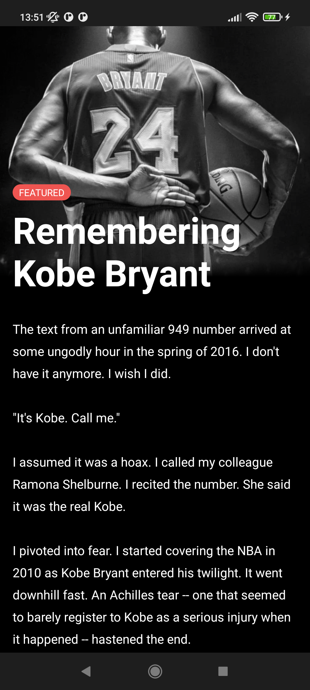

# Playground Jetpack Compose Samples

For more information, please [read the documentation](https://developer.android.com/jetpack/compose)

💻 Requirements
------------
To try out these sample apps, you need to use [Android Studio Arctic Fox](https://developer.android.com/studio).
You can clone this repository or import the
project from Android Studio following the steps
[here](https://developer.android.com/jetpack/compose/setup#sample).

🧬 Samples
------------
| Project | |
|:-----|---------|
|    A sample of any Detail Screen using Parallax Effect    • Easy complexity • UI • Animation • Resource loading  • Basic UI Testing    **[> Inspiration](https://dribbble.com/shots/15690299-The-Athletic-Case-study/attachments/7488059?mode=media)**   |  |
|  |  |
<!-- |   </img>   A sample chat app that focuses on UI state patterns and text input.  • Low complexity • Simple Material Design theme (Light & dark) • Resource loading • Back button handling • Integration with Architecture Components: Navigation, Fragments, LiveData, ViewModel • Animation • UI Testing  **[> Browse](Jetchat/)**    | | -->
<!-- |  |  | -->
<!-- |  </img>   A sample survey app that showcases text input, validation and UI state management in Compose.  • Low complexity • `TextField` and form validation • Snackbar implementation • Element reusability and styling • Various form elements   **[> Browse](Jetsurvey/)**    |  | -->
<!-- |  |  | -->
<!-- |  </img>   Jetsnack is a sample snack ordering app built with Compose.  • Medium complexity • Custom design system • Custom layouts • Animation  **[> Browse](Jetsnack/)**     | | -->
<!-- |  |  | -->
<!-- |  </img>   A sample podcast app that features a full-featured, Redux-style architecture and showcases dynamic themes.  • Advanced sample • Dynamic theming using podcast artwork • Image fetching • [`WindowInsets`](https://developer.android.com/reference/kotlin/android/view/WindowInsets) support • Coroutines • Local storage with Room  **[> Browse](Jetcaster/)**     | | -->
<!-- |  |  | -->
<!-- |  </img>    A Compose implementation of the Rally Material study, a financial app that focuses on data, charts, reusability and animations.  • Low complexity • Material theming with a dark-only theme • Custom layouts and reusable elements • Charts and tables • Animations • Screenshot tests  **[> Browse](Rally/)**     | | -->
<!-- |  |  | -->
<!-- |  </img>    A Compose implementation of the Crane Material study, a travel app that uses Material Design components and Material Theming to create a personalized, on-brand experience.  • Medium complexity • Draggable UI elements • Android Views inside Compose • UI state handling • UI Tests  **[> Browse](Crane/)**     | | -->
<!-- |  |  | -->
<!-- |  </img>    A Compose implementation of the Owl Material study. The Owl brand uses bold color, shape, and typography to express its brand attributes: energy, daring, and fun.  • Medium complexity • Material theming & light/dark themes • Custom layout • Animation  **[> Browse](Owl/)**     | | -->

